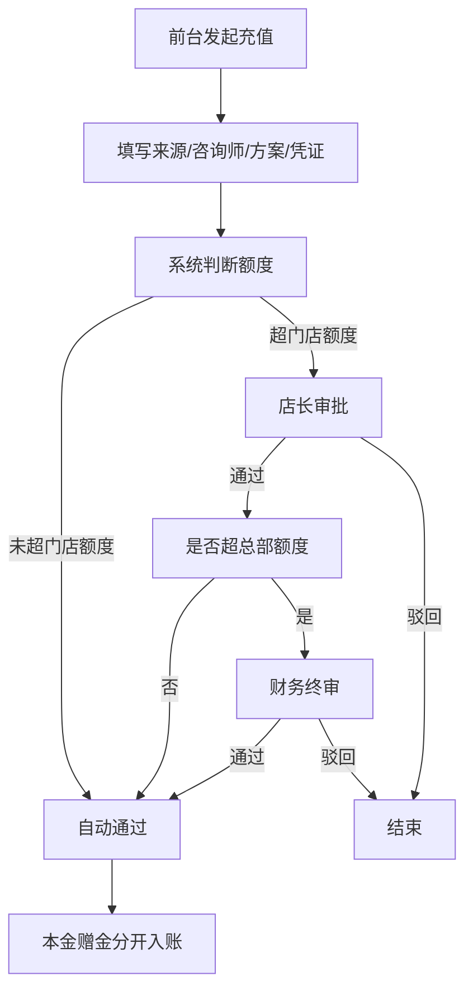

## 1. 产品概述

连锁医美机构会员储值风控Web后台，面向总部财务与门店店长，聚焦储值资金安全管理。通过充值审批、风险预警、跨店结算、退款管控等核心功能，帮助连锁机构管住充值、赠送、退款和跨店消耗四大风险点，保障总部资金安全。

## 2. 核心功能

### 2.1 用户角色

| 角色 | 登录方式 | 核心权限 |
|------|----------|----------|
| 总部财务 | 账号密码 | 全部门店数据查看、充值审批、退款审批、规则配置、导出对账、操作日志 |
| 门店店长 | 账号密码 | 本店数据查看、本店充值审批、风险处理、本店退款审核 |
| 前台顾问 | 账号密码 | 发起充值、会员查询、消费核销、退款申请 |

### 2.2 功能模块

1. **首页风险看板**：风险概览、门店储值风险排行、今日待办、异常预警
2. **会员储值档案**：会员列表、余额详情（本金/赠金拆分）、储值记录、消费记录、账户冻结
3. **充值审批**：充值申请列表、大额复核、审批流程、付款凭证查看
4. **消费核销**：项目消费、本金赠金抵扣计算、跨店消费归属、核销记录
5. **退款退卡**：退款模拟计算、退款申请、已消耗赠金扣回、手续费计算
6. **规则配置**：门店额度配置、赠送比例规则、风险阈值设置、审批流程配置

### 2.3 页面详情

| 页面名称 | 模块名称 | 功能描述 |
|----------|----------|----------|
| 首页风险看板 | 风险概览卡片 | 显示总储值余额、本金余额、赠金余额、今日充值、今日消费、今日退款 |
| 首页风险看板 | 门店风险排行 | 按风险评分排序的门店排行榜，标红高风险门店 |
| 首页风险看板 | 待办事项 | 待审批充值、待审核退款、异常预警数量及快捷入口 |
| 首页风险看板 | 异常预警列表 | 短期多次充值、频繁换手机号、高赠送比例等风险提示 |
| 会员储值档案 | 会员列表 | 搜索、筛选、分页，显示会员基本信息和余额概览 |
| 会员储值档案 | 会员详情 | 本金/赠金余额拆分、储值记录、消费记录、退款记录 |
| 会员储值档案 | 账户操作 | 冻结/解冻账户、备注信息、风险标记 |
| 充值审批 | 充值申请列表 | 按状态筛选、门店筛选、金额筛选 |
| 充值审批 | 充值详情 | 顾客来源、咨询师、活动方案、付款凭证、本金赠金明细 |
| 充值审批 | 审批操作 | 通过、驳回、转交上级审批，填写审批意见 |
| 消费核销 | 消费录入 | 选择会员、选择项目、自动计算抵扣方案 |
| 消费核销 | 抵扣计算 | 按规则自动计算扣本金还是扣赠金及金额 |
| 消费核销 | 跨店标识 | 显示原充值门店、业绩归属比例 |
| 消费核销 | 核销记录 | 历史消费记录查询、撤销操作 |
| 退款退卡 | 退款模拟 | 输入退款金额，模拟可退金额、已消耗赠金、手续费 |
| 退款退卡 | 退款申请 | 提交退款申请、上传凭证、填写原因 |
| 退款退卡 | 退款审批 | 财务审核、退款到账确认 |
| 规则配置 | 门店额度 | 各门店单笔/单日充值额度配置 |
| 规则配置 | 赠送规则 | 充值档位、赠送比例、赠送上限 |
| 规则配置 | 风险阈值 | 多次充值频次、换号次数、赠送比例警戒线 |
| 规则配置 | 审批流程 | 审批层级、审批人配置 |

## 3. 核心流程

### 3.1 充值审批流程

前台发起储值申请 → 填写顾客来源/咨询师/活动方案/付款凭证 → 系统判断是否超门店额度 → 未超额：自动通过；超额：进入店长审批 → 店长审批通过/驳回 → 超更大额度：进入财务终审 → 财务审批 → 充值到账（本金+赠金分开入账）

### 3.2 消费核销流程

选择会员 → 选择消费项目 → 系统根据规则自动计算本金/赠金抵扣比例 → 跨店消费显示原充值门店和业绩归属 → 确认核销 → 扣减对应余额 → 生成消费记录

### 3.3 退款退卡流程

选择会员 → 输入退款金额 → 系统模拟计算（可退金额、已消耗赠金扣回、手续费） → 提交退款申请 → 店长/财务审批 → 确认退款到账 → 余额扣减（先扣赠金，后扣本金） → 生成退款记录

### 3.4 风险监控流程

系统定时扫描 → 检测短期多次充值 → 检测频繁更换手机号 → 检测异常高赠送比例 → 生成风险预警 → 推送至风险看板 → 财务/店长处理 → 标记处理结果

## 4. 用户界面设计

### 4.1 设计风格

- **主色调**：深海蓝 (#0F172A) 作为主背景，营造专业稳重的金融风控氛围
- **强调色**：风险红 (#EF4444) 用于高风险提示，成功绿 (#10B981) 用于正常状态，警告橙 (#F59E0B) 用于中等风险
- **辅助色**：蓝色 (#3B82F6) 用于主要操作按钮和链接
- **整体风格**：专业数据风控后台风格，深色侧边栏 + 浅色内容区，卡片式布局，数据可视化清晰
- **字体**：系统默认无衬线字体，数字使用等宽字体增强可读性
- **图标**：线性图标，统一风格

### 4.2 页面设计概览

| 页面名称 | 模块名称 | UI 元素 |
|----------|----------|---------|
| 首页风险看板 | 风险概览卡片 | 6个数据卡片，网格布局，金额用大号字体显示，本金绿色、赠金橙色 |
| 首页风险看板 | 门店风险排行 | 排行榜表格，风险评分进度条，前3名特殊样式，红橙黄分级 |
| 首页风险看板 | 待办事项 | 3个数字卡片，带图标，点击跳转对应页面 |
| 首页风险看板 | 异常预警列表 | 列表卡片，红色标签标记风险类型，时间、会员信息 |
| 会员储值档案 | 会员列表 | 搜索栏 + 筛选条件 + 数据表格，余额列双色显示 |
| 会员储值档案 | 会员详情 | 侧边滑出或详情页，余额概览卡片 + 标签页切换记录 |
| 充值审批 | 申请列表 | 状态标签 + 表格，金额高亮，操作列有审批按钮 |
| 消费核销 | 消费录入 | 左侧会员选择，右侧项目选择，底部抵扣计算预览 |
| 退款退卡 | 退款模拟 | 输入框 + 计算结果卡片，分项列出可退金额、赠金扣回、手续费 |
| 规则配置 | 配置表单 | 分组卡片式表单，保存按钮固定底部 |

### 4.3 响应式

- 桌面端优先设计，最低支持 1366px 宽度
- 侧边栏可折叠，适配不同屏幕宽度
- 表格支持横向滚动，确保小屏可查看完整数据
- 不针对移动端做深度优化，但保证基本可用性

### 4.4 交互细节

- 表格行悬停高亮效果
- 风险等级颜色渐变（绿色→黄色→橙色→红色）
- 审批状态标签带背景色和圆角
- 金额数字千分位格式化
- 按钮点击反馈、加载状态
- 页面切换淡入过渡
