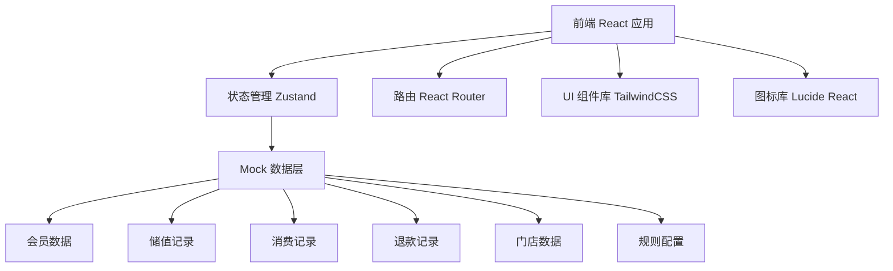
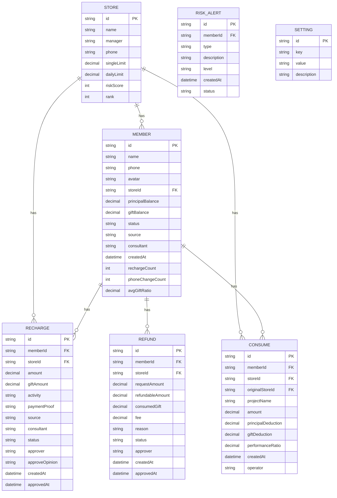

## 1. 架构设计



## 2. 技术说明

- **前端框架**：React@18 + TypeScript
- **构建工具**：Vite@5
- **样式方案**：TailwindCSS@3
- **状态管理**：Zustand@4
- **路由管理**：React Router DOM@6
- **图标库**：Lucide React
- **后端**：无后端，纯前端 Mock 数据
- **数据存储**：LocalStorage 持久化 + Mock 初始数据

## 3. 路由定义

| 路由 | 页面名称 | 说明 |
|------|----------|------|
| /dashboard | 首页风险看板 | 默认首页，展示风险概览、门店排行、待办事项、异常预警 |
| /members | 会员储值档案 | 会员列表、会员详情、储值记录、账户操作 |
| /recharge | 充值审批 | 充值申请列表、审批操作、充值详情 |
| /consume | 消费核销 | 消费录入、抵扣计算、核销记录 |
| /refund | 退款退卡 | 退款模拟、退款申请、退款审批 |
| /settings | 规则配置 | 门店额度、赠送规则、风险阈值、审批流程 |

## 4. 数据模型

### 4.1 数据模型定义



### 4.2 核心数据类型

```typescript
// 会员
interface Member {
  id: string;
  name: string;
  phone: string;
  avatar: string;
  storeId: string;
  storeName: string;
  principalBalance: number; // 本金余额
  giftBalance: number; // 赠金余额
  status: 'normal' | 'frozen'; // 账户状态
  source: string; // 顾客来源
  consultant: string; // 咨询师
  createdAt: string;
  riskTags: string[]; // 风险标签
  rechargeCount30d: number; // 30天充值次数
  phoneChangeCount: number; // 换手机号次数
  avgGiftRatio: number; // 平均赠送比例
}

// 充值记录
interface RechargeRecord {
  id: string;
  memberId: string;
  memberName: string;
  memberPhone: string;
  storeId: string;
  storeName: string;
  amount: number; // 充值金额
  giftAmount: number; // 赠送金额
  giftRatio: number; // 赠送比例
  activity: string; // 活动方案
  paymentProof: string; // 付款凭证
  source: string; // 顾客来源
  consultant: string; // 咨询师
  status: 'pending' | 'approved' | 'rejected' | 'pending_finance'; // 审批状态
  approver?: string;
  approveOpinion?: string;
  createdAt: string;
  approvedAt?: string;
}

// 消费记录
interface ConsumeRecord {
  id: string;
  memberId: string;
  memberName: string;
  storeId: string;
  storeName: string;
  originalStoreId: string; // 原充值门店
  originalStoreName: string;
  projectName: string;
  amount: number;
  principalDeduction: number; // 扣本金
  giftDeduction: number; // 扣赠金
  performanceRatio: number; // 业绩归属比例
  isCrossStore: boolean; // 是否跨店
  createdAt: string;
  operator: string;
}

// 退款记录
interface RefundRecord {
  id: string;
  memberId: string;
  memberName: string;
  storeId: string;
  storeName: string;
  requestAmount: number; // 申请退款金额
  refundableAmount: number; // 可退金额
  consumedGift: number; // 已消耗赠金需扣回
  fee: number; // 手续费
  reason: string;
  status: 'pending' | 'approved' | 'rejected';
  approver?: string;
  createdAt: string;
  approvedAt?: string;
}

// 门店
interface Store {
  id: string;
  name: string;
  manager: string;
  phone: string;
  singleLimit: number; // 单笔额度
  dailyLimit: number; // 单日额度
  riskScore: number; // 风险评分 0-100
  totalBalance: number; // 储值总余额
  todayRecharge: number; // 今日充值
  todayConsume: number; // 今日消费
}

// 风险预警
interface RiskAlert {
  id: string;
  memberId: string;
  memberName: string;
  type: 'frequent_recharge' | 'phone_change' | 'high_gift_ratio' | 'large_refund';
  description: string;
  level: 'high' | 'medium' | 'low';
  createdAt: string;
  status: 'pending' | 'handled';
}

// 规则配置
interface RuleSettings {
  stores: Store[];
  giftRules: GiftRule[];
  riskThresholds: RiskThresholds;
  approvalFlow: ApprovalFlow;
}

interface GiftRule {
  id: string;
  minAmount: number;
  maxAmount: number;
  giftRatio: number;
  maxGift: number;
}

interface RiskThresholds {
  frequentRechargeDays: number; // 多次充值时间窗口（天）
  frequentRechargeCount: number; // 多次充值次数阈值
  phoneChangeCount: number; // 换号次数阈值
  highGiftRatio: number; // 高赠送比例阈值
}

interface ApprovalFlow {
  storeLimit: number; // 门店审批额度
  financeLimit: number; // 财务审批额度
}
```

## 5. 项目结构

```
src/
├── components/          # 通用组件
│   ├── Layout/          # 布局组件
│   │   ├── Sidebar.tsx  # 侧边栏
│   │   ├── Header.tsx   # 顶部导航
│   │   └── index.tsx    # 布局容器
│   ├── DataTable/       # 数据表格组件
│   ├── StatusBadge/     # 状态标签组件
│   ├── AmountDisplay/   # 金额显示组件
│   ├── Modal/           # 弹窗组件
│   └── Card/            # 卡片组件
├── pages/               # 页面组件
│   ├── Dashboard/       # 首页风险看板
│   ├── Members/         # 会员储值档案
│   ├── Recharge/        # 充值审批
│   ├── Consume/         # 消费核销
│   ├── Refund/          # 退款退卡
│   └── Settings/        # 规则配置
├── store/               # 状态管理 (Zustand)
│   ├── useMemberStore.ts
│   ├── useRechargeStore.ts
│   ├── useConsumeStore.ts
│   ├── useRefundStore.ts
│   ├── useStoreStore.ts
│   └── useSettingsStore.ts
├── mock/                # Mock 数据
│   ├── members.ts
│   ├── recharges.ts
│   ├── consumes.ts
│   ├── refunds.ts
│   ├── stores.ts
│   └── alerts.ts
├── utils/               # 工具函数
│   ├── format.ts        # 格式化工具
│   ├── calculator.ts    # 计算工具（抵扣、退款等）
│   └── validate.ts      # 校验工具
├── types/               # TypeScript 类型定义
│   └── index.ts
├── App.tsx
├── main.tsx
└── index.css
```

## 6. 核心业务计算规则

### 6.1 消费抵扣规则

默认按以下顺序抵扣：
1. 优先扣赠金，赠金不足部分扣本金
2. 特定项目只能扣本金（配置项）
3. 跨店消费时，业绩按比例归属原充值门店和消费门店

### 6.2 退款计算规则

退款金额 = 申请退款金额
可退金额 = 退款金额 - 已消耗赠金 - 手续费

已消耗赠金计算：
- 按历史消费中赠金消耗比例计算
- 赠金消耗比例 = 历史赠金消耗总额 / 历史充值赠金总额

手续费 = 可退金额 × 手续费率（配置项，默认 5%）

### 6.3 风险评分规则

门店风险评分 = 加权计算
- 异常预警数量占比 40%
- 高赠送比例订单占比 30%
- 退款率 20%
- 跨店消费占比 10%
